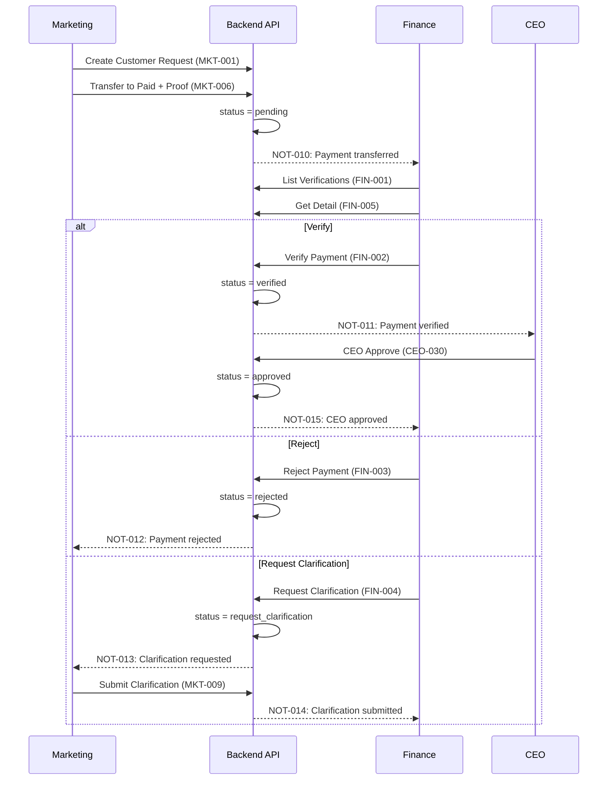
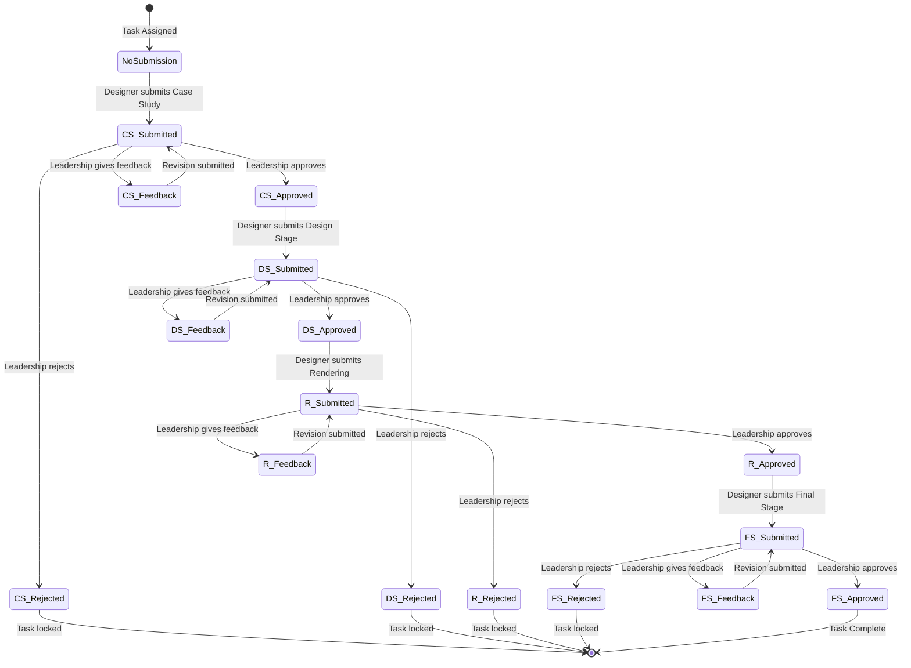
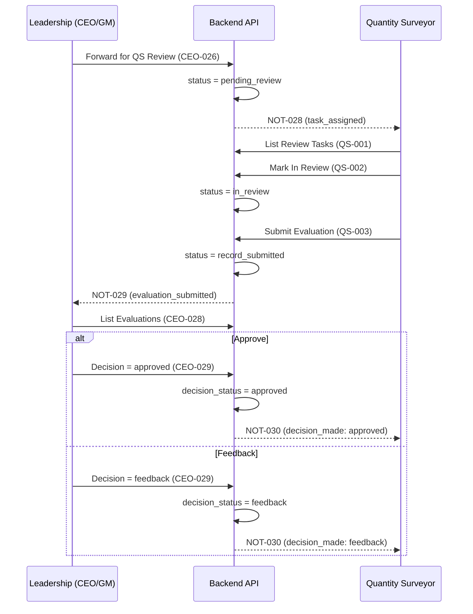
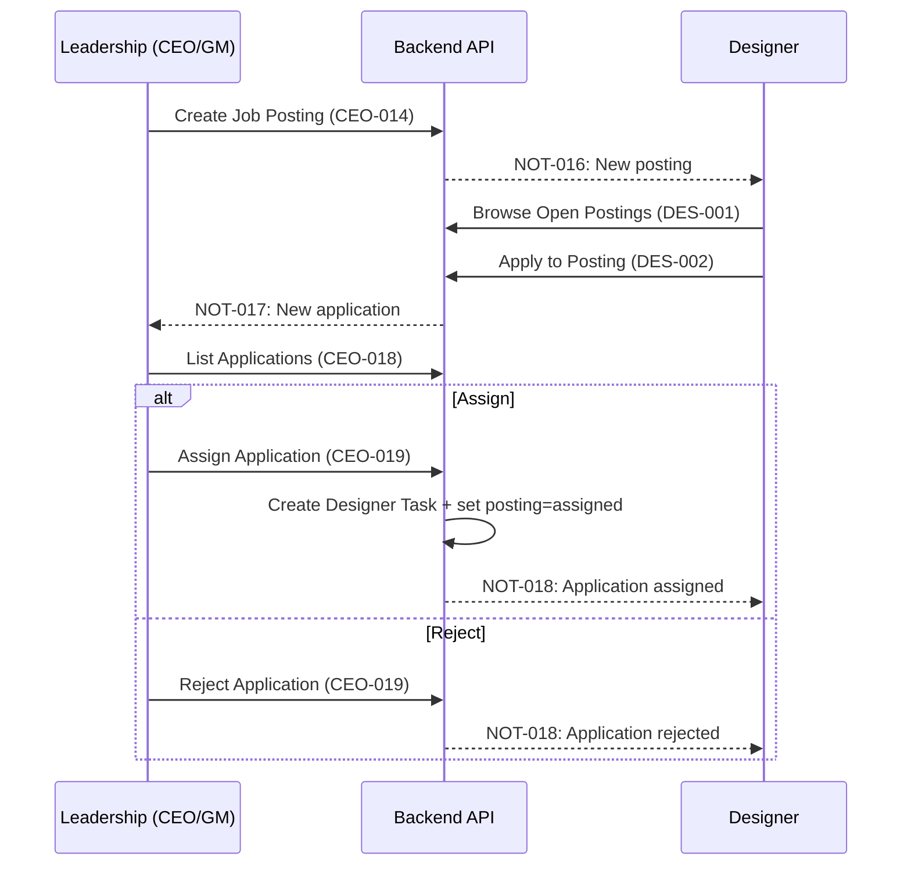
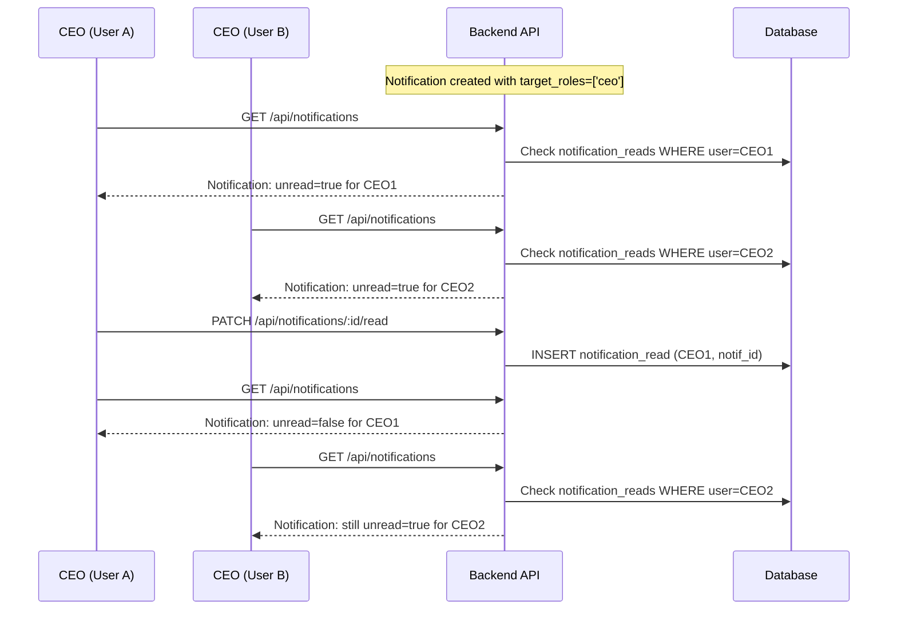
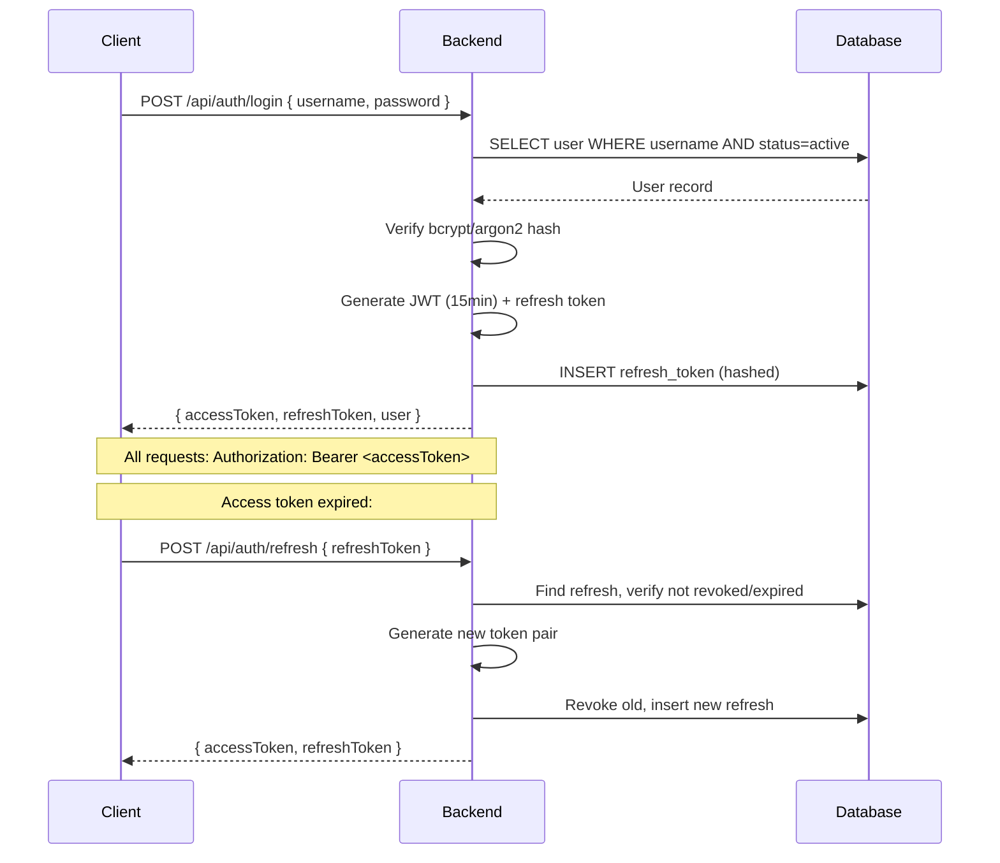

# Backend Architecture — Workflow Management System

**Document Version:** 1.0  
**Target Audience:** Backend Developers, Database Designers, API Developers  
**Source:** Reverse-engineered from frontend codebase (React + TypeScript + localStorage)

---

# 1. Project Overview

## 1.1 Purpose
The Workflow Management System is a role-based operational platform for construction and design firms. It orchestrates the full lifecycle: customer intake → payment verification → project creation → task assignment → multi-phase design production → quantity/cost review → site execution → performance evaluation.

## 1.2 Goals
1. Single source of truth for operational data across 8 roles.
2. Role-based access control (RBAC) at the API layer.
3. Full audit history for every state-changing action.
4. Multi-role notification with independent read-status per user.
5. Gated, linear workflow progression (4-phase designer pipeline).
6. REST API consumed by a Telegram Mini App frontend.

## 1.3 Users (Roles)
| Role Code | Role Name | Summary |
|-----------|-----------|---------|
| `ceo` | Chief Executive Officer | Full oversight, user management, finance decisions, escalation |
| `general_manager` | General Manager | Operational leadership, task assignment, approval review |
| `marketing_lead` | Marketing Lead | Customer intake, paid-customer handling, clarification responses |
| `finance_officer` | Finance Officer | Payment verification, rejection, clarification requests |
| `data_collector` | Data Collector | Field data capture, evidence submission |
| `quantity_surveyor` | Quantity Surveyor | Cost/quality evaluation of design submissions |
| `designer` | Designer | Job applications, multi-phase design submission |
| `site_engineer` | Site Engineer | Field task execution, status updates, evidence capture |

## 1.4 Main Workflow
```
Customer Intake (Marketing)
  → Payment Upload (Marketing)
  → Payment Verification (Finance)
  → CEO Approval
  → Project Creation (CEO/GM)
  → Job Posting (CEO/GM)
  → Designer Application (Designer)
  → Assignment (CEO/GM)
  → Multi-Phase Design Production (Designer)
  → Phase Review (CEO/GM)
  → Quantity Surveyor Review (QS)
  → Leadership Decision (CEO/GM)
  → Site Execution (Site Engineer)
  → Performance Rating (CEO/GM)
```

---

# 2. User Roles & Functional Requirements

## 2.1 Authentication / User Management

| ID | Title | Description | Dependencies | Related Tables |
|----|-------|-------------|-------------|----------------|
| AUTH-001 | Login | Authenticate user, return JWT access + refresh tokens | None | `users`, `refresh_tokens` |
| AUTH-002 | Logout | Invalidate refresh token | AUTH-001 | `refresh_tokens` |
| AUTH-003 | Get Current User | Return authenticated user profile from JWT | AUTH-001 | `users` |
| AUTH-004 | Refresh Token | Exchange refresh token for new access token | AUTH-001 | `refresh_tokens` |
| USR-001 | List Users | Paginated user list with role/status/search filters | AUTH-001 | `users` |
| USR-002 | Create User | CEO creates user with role, hashed password | USR-001 | `users` |
| USR-003 | Get User | Retrieve single user by ID | AUTH-001 | `users` |
| USR-004 | Update User | Update profile/role/status; CEO changes role; self changes profile | USR-003 | `users` |
| USR-005 | Soft Delete User | Set status=deleted, deleted_at=NOW() | USR-003 | `users` |

## 2.2 Marketing Lead

| ID | Title | Description | Dependencies | Related Tables |
|----|-------|-------------|-------------|----------------|
| MKT-001 | Create Customer Request | Intake new customer lead with contact/category/description | AUTH-001 | `customer_requests` |
| MKT-002 | List Customer Requests | View requests with status/category/search filters | MKT-001 | `customer_requests` |
| MKT-003 | Get Customer Request | View single request detail | MKT-002 | `customer_requests` |
| MKT-004 | Update Customer Request | Edit request fields (cannot edit after transfer) | MKT-003 | `customer_requests` |
| MKT-005 | Delete Customer Request | Remove request (cannot delete after transfer) | MKT-003 | `customer_requests` |
| MKT-006 | Transfer to Paid Customer | Move request to paid pipeline with payment proof files | MKT-003 | `customer_requests`, `paid_customers`, `payment_proofs`, `finance_history` |
| MKT-007 | List Paid Customers | View paid records with status filter | MKT-006 | `paid_customers`, `payment_proofs` |
| MKT-008 | Get Paid Customer | Full detail with verification history and clarifications | MKT-007 | `paid_customers`, `payment_proofs`, `finance_history`, `clarification_responses` |
| MKT-009 | Submit Clarification Response | Respond to finance request with description + attachments | MKT-008, FIN-004 | `paid_customers`, `clarification_responses`, `clarification_attachments` |
| MKT-010 | Resubmit Payment After Feedback | Submit new proof files after finance feedback | MKT-008 | `paid_customers`, `payment_proofs`, `finance_history` |
| MKT-011 | View Finance Review Result | See finance decision (verify/reject/clarify) and notes | MKT-008, FIN-002/003/004 | `paid_customers`, `finance_history` |
| MKT-012 | View Marketing Dashboard | Aggregated metrics for marketing | AUTH-001 | `customer_requests`, `paid_customers`, `notifications` |
| MKT-013 | View Notifications | List notifications for marketing_lead role | AUTH-001 | `notifications` |
| MKT-014 | Mark Notification Read | Mark single or all notifications read | MKT-013 | `notification_reads` |

## 2.3 Finance Officer

| ID | Title | Description | Dependencies | Related Tables |
|----|-------|-------------|-------------|----------------|
| FIN-001 | List Finance Verifications | View verification queue by tab (5 tabs) | AUTH-001 | `paid_customers`, `payment_proofs`, `finance_history` |
| FIN-002 | Verify Payment | Approve payment proof → status=verified; notify CEO | FIN-001 | `paid_customers`, `finance_history`, `notifications` |
| FIN-003 | Reject Payment | Reject payment proof → status=rejected; mandatory note | FIN-001 | `paid_customers`, `finance_history`, `notifications` |
| FIN-004 | Request Clarification | Ask marketing for more info → status=request_clarification | FIN-001 | `paid_customers`, `finance_history`, `notifications` |
| FIN-005 | Get Verification Detail | Full record with finance history and clarifications | FIN-001 | `paid_customers`, `payment_proofs`, `finance_history`, `clarification_responses` |
| FIN-006 | View Finance Dashboard | Aggregated counts for finance | AUTH-001 | `paid_customers`, `notifications` |
| FIN-007 | View Notifications | List notifications for finance_officer role | AUTH-001 | `notifications` |
| FIN-008 | Mark Notification Read | Mark single or all notifications read | FIN-007 | `notification_reads` |

## 2.4 CEO

| ID | Title | Description | Dependencies | Related Tables |
|----|-------|-------------|-------------|----------------|
| CEO-001 | View Main Dashboard | Aggregated counts (projects, tasks, approvals, notifications) | AUTH-001 | `projects`, `tasks`, `approvals`, `job_postings`, `notifications`, `paid_customers` |
| CEO-002 | List Projects | All projects with filters | AUTH-001 | `projects` |
| CEO-003 | Create Project | New project with client/stage/deadline/assignment | CEO-002 | `projects` |
| CEO-004 | Get Project | Project detail with task counts and documents | CEO-002 | `projects`, `tasks`, `documents` |
| CEO-005 | Update Project | Edit project fields, stage, status | CEO-004 | `projects` |
| CEO-006 | Delete Project | Soft-delete/archive project; cascade archive tasks/docs | CEO-004 | `projects`, `tasks`, `documents` |
| CEO-007 | List Tasks | All tasks with status/assignee/project/approval filters | AUTH-001 | `tasks` |
| CEO-008 | Create Task | New task with title/description/instruction/assign/deadline | CEO-002 | `tasks` |
| CEO-009 | Get Task | Task detail with submissions/feedbacks/attachments | CEO-007 | `tasks`, `submissions`, `feedbacks`, `task_attachments` |
| CEO-010 | Update Task | Edit task fields | CEO-009 | `tasks` |
| CEO-011 | Change Task Status | Update status (pending/in_progress/completed/incomplete/rejected) | CEO-009 | `tasks` |
| CEO-012 | Approve Task | Approve with optional feedback; sets approvalStatus=approved | CEO-009 | `tasks` |
| CEO-013 | Reject Task | Reject with mandatory feedback; sets approvalStatus=rejected | CEO-009 | `tasks` |
| CEO-014 | Create Job Posting | New posting with project/title/storyPoints/deadline | AUTH-001 | `job_postings` |
| CEO-015 | List Job Postings | All postings with status/project filters | CEO-014 | `job_postings` |
| CEO-016 | Update Job Posting | Edit posting fields | CEO-015 | `job_postings` |
| CEO-017 | Delete Job Posting | Delete posting; cascade-delete pending applications | CEO-015 | `job_postings`, `designer_applications` |
| CEO-018 | List Applications | All applications for a posting | CEO-015 | `designer_applications` |
| CEO-019 | Review Application | Assign (create designer task) or reject with note | CEO-018 | `designer_applications`, `designer_tasks` |
| CEO-020 | Create Designer Task | New designer task with story_points, project, assignment | AUTH-001 | `designer_tasks` |
| CEO-021 | List Designer Tasks | All designer tasks (scoped) | CEO-020 | `designer_tasks` |
| CEO-022 | Get Designer Progress | All 4 phases with submission history and review trail | CEO-021 | `designer_tasks`, `designer_phase_submissions`, `designer_phase_reviews` |
| CEO-023 | Review Designer Phase | Approve/feedback/reject on phase with snapshot preservation | CEO-022, DES-015 | `designer_phase_submissions`, `designer_phase_reviews` |
| CEO-024 | Submit Performance Review | Rate completed task (creativity/timeliness/understanding/rendering 0-5) | CEO-021 | `designer_performance_reviews` |
| CEO-025 | View Performance Dashboard | Aggregated designer metrics (completions, averages, throughput) | AUTH-001 | `designer_tasks`, `designer_performance_reviews` |
| CEO-026 | Create QS Review Task | Forward design submission for cost/quality review | AUTH-001 | `quantity_review_tasks`, `notifications` |
| CEO-027 | List QS Review Tasks | All review tasks with status filter | CEO-026 | `quantity_review_tasks` |
| CEO-028 | List QS Evaluations | All evaluation records | AUTH-001 | `quantity_review_evaluations` |
| CEO-029 | Leadership Decision on QS | Final decision (approved/feedback) on QS evaluation | CEO-028, QS-004 | `quantity_review_evaluations`, `notifications` |
| CEO-030 | CEO Approve Finance | Final approval of finance-verified record → status=approved | FIN-002 | `paid_customers`, `finance_history` |
| CEO-031 | List Approvals | Project-stage approval items | AUTH-001 | `approvals` |
| CEO-032 | Review Approval | Approve/reject approval request | CEO-031 | `approvals` |
| CEO-033 | List DC Tasks | Data collector tasks with submissions/feedbacks | AUTH-001 | `data_collector_tasks`, `submissions`, `feedbacks` |
| CEO-034 | Create DC Task | New data collection task with assignment | AUTH-001 | `data_collector_tasks` |
| CEO-035 | Approve DC Submission | Approve evidence submission with optional feedback | CEO-033 | `submissions` |
| CEO-036 | Add Feedback | Add feedback (rich text) on task/submission; version auto-increments | AUTH-001 | `feedbacks` |
| CEO-037 | View Customer Data | All customer requests and paid customer records | AUTH-001 | `customer_requests`, `paid_customers` |
| CEO-038 | View Notifications | List notifications for CEO role (independent read per user) | AUTH-001 | `notifications`, `notification_reads` |
| CEO-039 | Mark Notification Read | Mark single/bulk as read; does not affect other roles/users | CEO-038 | `notification_reads` |
| CEO-040 | View Audit Logs | Audit trail with entity/action/date range filters | AUTH-001 | `audit_logs` |

## 2.5 General Manager

| ID | Title | Description | Dependencies | Related Tables |
|----|-------|-------------|-------------|----------------|
| GM-001 | View Main Dashboard | Same as CEO-001 | AUTH-001 | `projects`, `tasks`, `approvals`, `job_postings`, `notifications`, `paid_customers` |
| GM-002 | List Projects | All projects with filters | AUTH-001 | `projects` |
| GM-003 | Create Project | New project | GM-002 | `projects` |
| GM-004 | Get Project | Project detail | GM-002 | `projects`, `tasks`, `documents` |
| GM-005 | Update Project | Edit project (cannot delete) | GM-004 | `projects` |
| GM-006 | List Tasks | All tasks with filters | AUTH-001 | `tasks` |
| GM-007 | Create Task | New task | GM-002 | `tasks` |
| GM-008 | Get Task | Task detail | GM-006 | `tasks`, `submissions`, `feedbacks`, `task_attachments` |
| GM-009 | Update Task | Edit task | GM-008 | `tasks` |
| GM-010 | Approve Task | Approve with optional feedback | GM-008 | `tasks` |
| GM-011 | Reject Task | Reject with mandatory feedback | GM-008 | `tasks` |
| GM-012 | Create Job Posting | New posting | AUTH-001 | `job_postings` |
| GM-013 | List Job Postings | All postings | GM-012 | `job_postings` |
| GM-014 | List Applications | Applications for posting | GM-013 | `designer_applications` |
| GM-015 | Review Application | Assign/reject with note | GM-014 | `designer_applications`, `designer_tasks` |
| GM-016 | Create Designer Task | New designer task | AUTH-001 | `designer_tasks` |
| GM-017 | List Designer Tasks | All (scoped) | GM-016 | `designer_tasks` |
| GM-018 | Get Designer Progress | 4-phase progress | GM-017 | `designer_tasks`, `designer_phase_submissions`, `designer_phase_reviews` |
| GM-019 | Review Designer Phase | Phase review (approve/feedback/reject) | GM-018, DES-015 | `designer_phase_submissions`, `designer_phase_reviews` |
| GM-020 | Submit Performance Review | Rate completed task | GM-017 | `designer_performance_reviews` |
| GM-021 | View Performance Dashboard | Designer metrics | AUTH-001 | `designer_tasks`, `designer_performance_reviews` |
| GM-022 | Create QS Review Task | Forward for QS review | AUTH-001 | `quantity_review_tasks`, `notifications` |
| GM-023 | List QS Review Tasks | All tasks with filter | GM-022 | `quantity_review_tasks` |
| GM-024 | List QS Evaluations | All evaluations | AUTH-001 | `quantity_review_evaluations` |
| GM-025 | Leadership Decision on QS | Final decision | GM-024, QS-004 | `quantity_review_evaluations`, `notifications` |
| GM-026 | List Approvals | Approval items | AUTH-001 | `approvals` |
| GM-027 | Review Approval | Approve/reject | GM-026 | `approvals` |
| GM-028 | List DC Tasks | DC tasks | AUTH-001 | `data_collector_tasks`, `submissions`, `feedbacks` |
| GM-029 | Create DC Task | New DC task | AUTH-001 | `data_collector_tasks` |
| GM-030 | Approve DC Submission | Approve evidence | GM-028 | `submissions` |
| GM-031 | Add Feedback | Feedback on task | AUTH-001 | `feedbacks` |
| GM-032 | View Customer Data | Customer records (read-only) | AUTH-001 | `customer_requests`, `paid_customers` |
| GM-033 | View SE Dashboard | Site engineer metrics | AUTH-001 | `tasks`, `projects` |
| GM-034 | View Users | User list (view-only, cannot modify) | AUTH-001 | `users` |
| GM-035 | View Notifications | List for GM role | AUTH-001 | `notifications`, `notification_reads` |
| GM-036 | Mark Notification Read | Mark read | GM-035 | `notification_reads` |

## 2.6 Designer

| ID | Title | Description | Dependencies | Related Tables |
|----|-------|-------------|-------------|----------------|
| DES-001 | Browse Open Job Postings | List open postings (status=pending, unassigned) | AUTH-001 | `job_postings` |
| DES-002 | Apply to Job Posting | Submit application with message (one per posting) | DES-001 | `designer_applications` |
| DES-003 | List My Designer Tasks | Tasks assigned to authenticated designer | AUTH-001 | `designer_tasks` |
| DES-004 | Get My Task Progress | 4-phase progress with submission history and review feedback | DES-003 | `designer_tasks`, `designer_phase_submissions`, `designer_phase_reviews` |
| DES-005 | Submit Case Study | Phase 1 submission (note + optional screenshot) | DES-004 | `designer_phase_submissions` |
| DES-006 | Submit Design Stage | Phase 2 submission (requires phase 1 approved) | DES-004, DES-005 | `designer_phase_submissions` |
| DES-007 | Submit Rendering | Phase 3 submission (requires phase 2 approved) | DES-004, DES-006 | `designer_phase_submissions` |
| DES-008 | Submit Final Stage | Phase 4 submission (requires phase 3 approved, mandatory screenshot) | DES-004, DES-007 | `designer_phase_submissions` |
| DES-009 | Submit Phase Revision | Resubmit after feedback; creates new history entry | DES-004 | `designer_phase_submissions` |
| DES-010 | View Phase Review Result | See leadership review outcome per phase | DES-004, CEO-023 | `designer_phase_reviews` |
| DES-011 | View My Performance | Own performance scores and completion history | AUTH-001 | `designer_performance_reviews` |
| DES-012 | View Notifications | List for designer role | AUTH-001 | `notifications` |
| DES-013 | Mark Notification Read | Mark read | DES-012 | `notification_reads` |
| DES-014 | View My Application Status | See application status (pending/assigned/rejected) | DES-002 | `designer_applications` |
| DES-015 | Submit Phase (Generic) | Submit work for a specific phase (used by generic endpoint) | DES-004 | `designer_phase_submissions` |

## 2.7 Quantity Surveyor

| ID | Title | Description | Dependencies | Related Tables |
|----|-------|-------------|-------------|----------------|
| QS-001 | List Review Tasks | Assigned QS tasks with status filter | AUTH-001 | `quantity_review_tasks` |
| QS-002 | Mark Task In Review | Change status pending_review → in_review | QS-001 | `quantity_review_tasks` |
| QS-003 | Submit Evaluation | Cost evaluation with recommendation; creates notification for leadership | QS-002 | `quantity_review_evaluations`, `quantity_review_tasks`, `notifications` |
| QS-004 | List Evaluations | Own evaluations with filters | QS-003 | `quantity_review_evaluations` |
| QS-005 | View Leadership Decision | Final decision (approved/feedback) on evaluation | QS-004, CEO-029 | `quantity_review_evaluations` |
| QS-006 | View QS Notifications | QS-specific notifications (type: task_assigned/evaluation_submitted/decision_made) | AUTH-001 | `notifications` |
| QS-007 | Mark Role Notifications Read | Mark all by type for QS role; per-role independent read | QS-006 | `notification_reads` |
| QS-008 | View QS Dashboard | Aggregated counts for QS | AUTH-001 | `quantity_review_tasks`, `quantity_review_evaluations` |

## 2.8 Site Engineer

| ID | Title | Description | Dependencies | Related Tables |
|----|-------|-------------|-------------|----------------|
| SE-001 | List My Tasks | Tasks assigned to authenticated SE with status filter | AUTH-001 | `tasks` |
| SE-002 | Get Task Detail | Task with project context/instructions/deadline/attachments | SE-001 | `tasks`, `projects`, `task_attachments` |
| SE-003 | Update Task Description | Edit description (field notes/progress) | SE-002 | `tasks` |
| SE-004 | Change Task Status | Update status (pending/in_progress/completed/incomplete/rejected) | SE-002 | `tasks` |
| SE-005 | Upload Task Attachment | Field evidence (images/docs) attached to task | SE-002 | `task_attachments` |
| SE-006 | View SE Dashboard | Tasks by status, highlighted/new tasks, project summary | AUTH-001 | `tasks` |
| SE-007 | View Notifications | List for site_engineer role | AUTH-001 | `notifications` |
| SE-008 | Mark Notification Read | Mark read | SE-007 | `notification_reads` |

## 2.9 Data Collector

| ID | Title | Description | Dependencies | Related Tables |
|----|-------|-------------|-------------|----------------|
| DC-001 | List My Tasks | Tasks assigned to authenticated DC | AUTH-001 | `data_collector_tasks` |
| DC-002 | Get Task Detail | Task with project context/instruction/submissions/feedbacks | DC-001 | `data_collector_tasks`, `submissions`, `feedbacks` |
| DC-003 | Submit Evidence | Submit notes + file attachments → creates submission record | DC-002 | `submissions`, `submission_attachments` |
| DC-004 | View Submission Results | Leadership review results on submitted evidence | DC-003 | `submissions` |
| DC-005 | View Notifications | List for data_collector role | AUTH-001 | `notifications` |
| DC-006 | Mark Notification Read | Mark read | DC-005 | `notification_reads` |

---

# 3. Functional Requirement Catalog (Master Table)

| ID | Role | Feature | Description |
|----|------|---------|-------------|
| AUTH-001 | All | Login | Authenticate user, return JWT |
| AUTH-002 | All | Logout | Invalidate refresh token |
| AUTH-003 | All | Get Current User | Return user profile |
| AUTH-004 | All | Refresh Token | Exchange refresh for new access |
| USR-001 | CEO, GM | List Users | Paginated user list |
| USR-002 | CEO | Create User | New user with role/password |
| USR-003 | CEO, GM | Get User | Single user detail |
| USR-004 | CEO | Update User | Edit user profile/role/status |
| USR-005 | CEO | Soft Delete User | Mark user as deleted |
| MKT-001 | Marketing | Create Customer Request | Intake new lead |
| MKT-002 | Marketing, CEO, GM | List Customer Requests | View request list |
| MKT-003 | Marketing, CEO, GM | Get Customer Request | View request detail |
| MKT-004 | Marketing | Update Customer Request | Edit request |
| MKT-005 | Marketing, CEO | Delete Customer Request | Remove request |
| MKT-006 | Marketing | Transfer to Paid Customer | Move to paid pipeline |
| MKT-007 | Marketing, CEO, GM, Finance | List Paid Customers | View paid records |
| MKT-008 | Marketing, CEO, GM, Finance | Get Paid Customer | View paid detail |
| MKT-009 | Marketing | Submit Clarification | Respond to finance |
| MKT-010 | Marketing | Resubmit Payment Info | Resubmit after feedback |
| MKT-011 | Marketing | View Finance Review | See finance decision |
| MKT-012 | Marketing | View Dashboard | Marketing metrics |
| MKT-013 | Marketing | View Notifications | List notifications |
| MKT-014 | Marketing | Mark Notification Read | Mark as read |
| FIN-001 | Finance, CEO, GM | List Verifications | Queue by tab |
| FIN-002 | Finance | Verify Payment | Approve proof |
| FIN-003 | Finance | Reject Payment | Reject proof |
| FIN-004 | Finance | Request Clarification | Ask for more info |
| FIN-005 | Finance, CEO, GM | Get Verification Detail | Detail view |
| FIN-006 | Finance | View Dashboard | Finance metrics |
| FIN-007 | Finance | View Notifications | List notifications |
| FIN-008 | Finance | Mark Notification Read | Mark as read |
| CEO-001 | CEO | Main Dashboard | Aggregated counts |
| CEO-002–006 | CEO, GM | Projects CRUD | Project management |
| CEO-007–013 | CEO, GM | Tasks CRUD + Approve/Reject | Task management |
| CEO-014–019 | CEO, GM | Job Postings + Applications | Designer hiring |
| CEO-020–025 | CEO, GM, Designer | Designer Tasks + Phases + Performance | Designer workflow |
| CEO-026–029 | CEO, GM, QS | QS Review Tasks + Evaluations + Decision | QS workflow |
| CEO-030 | CEO | CEO Approve Finance | Final finance approval |
| CEO-031–032 | CEO, GM | Approvals | Project-stage approval |
| CEO-033–036 | CEO, GM | DC Tasks + Submissions + Feedback | Data collector |
| CEO-037 | CEO | View Customer Data | All customer records |
| CEO-038–039 | CEO | Notifications | List/mark read |
| CEO-040 | CEO | Audit Logs | Audit trail |
| GM-001–036 | GM | (see §2.5) | Mirror of CEO minus audit/user CRUD/delete |
| DES-001–015 | Designer | Designer workflow | Browse/apply/submit phases/view performance |
| QS-001–008 | QS | QS workflow | Review/evaluate/view decisions |
| SE-001–008 | SE | Site engineer | Tasks/status/evidence/dashboard |
| DC-001–006 | DC | Data collector | Tasks/submissions/evidence |

---

# 4. Business Rules

## 4.1 Customer Request Rules

- **BR-001:** Customer request cannot be transferred to paid pipeline more than once. Once transferred, source request archived (status='closed').
- **BR-002:** Cannot update/delete a transferred customer request.
- **BR-003:** If category='other', `otherCategoryDescription` is required.
- **BR-004:** Phone number must pass format validation.
- **BR-005:** Proof of payment files required when transferring to paid pipeline.

## 4.2 Payment Verification Rules

- **BR-006:** Status transitions: `pending` → `verified`|`rejected`|`request_clarification`; `verified` → `approved` (CEO only).
- **BR-007:** Only Finance Officer can verify/reject/clarify.
- **BR-008:** Only CEO can execute final "CEO approve" to set status=`approved`.
- **BR-009:** Clarification request requires mandatory message.
- **BR-010:** Rejection requires mandatory message.
- **BR-011:** All finance decisions recorded in finance_history (actor, timestamp, note).
- **BR-012:** Clarification response requires description + at least one image attachment.
- **BR-013:** Marketing can only respond when status=`request_clarification`.
- **BR-014:** Finance history and clarification responses preserved (immutable audit).

## 4.3 Designer Multi-Phase Workflow Rules

- **BR-015:** Phases strictly sequential: Case Study → Design Stage → Rendering → Final Stage. Cannot skip.
- **BR-016:** If phase review status=`rejected`, cannot submit further revisions. Task locked at that phase.
- **BR-017:** If review status=`feedback`, designer must submit revision to restart review.
- **BR-018:** Cannot proceed to next phase if current phase has `feedback` status.
- **BR-019:** All phase history preserved as immutable snapshots (note, screenshot, review status, message, timestamp).
- **BR-020:** Latest/live phase data stored separately from historical review trail.
- **BR-021:** Revision submissions create new designer submission snapshots appended to phase history.
- **BR-022:** Phase rejection → task overall status=`rejected`.
- **BR-023:** All 4 phases approved → task status=`completed`, approvalStatus=`approved`.
- **BR-024:** Final Stage requires screenshot (mandatory); other phases optional.
- **BR-025:** Designer can only submit to assigned tasks.
- **BR-026:** Performance reviews only for completed designer tasks.
- **BR-027:** Ratings 0–5, up to one decimal place.

## 4.4 Designer Application Rules

- **BR-028:** Designer cannot apply to same posting twice.
- **BR-029:** Cannot apply to posting that already has assigned designer.
- **BR-030:** Only CEO/GM can review applications.
- **BR-031:** Application assigned → applicant becomes task's `assignedTo`; posting status=`assigned`.
- **BR-032:** Application rejected → status updated with reviewer note.
- **BR-033:** Assigned application creates corresponding designer task record.

## 4.5 Quantity Surveyor Rules

- **BR-034:** Status transitions: `pending_review` → `in_review` → `record_submitted`.
- **BR-035:** Only assigned QS can mark in_review or submit evaluation.
- **BR-036:** Only CEO/GM can forward design submission for QS review.
- **BR-037:** Evaluation cannot be submitted unless task status=`in_review`.
- **BR-038:** Recommendation: `recommended_for_approval` or `recommends_revision`.
- **BR-039:** Leadership decision: `approved` or `feedback`.
- **BR-040:** Evaluation submitted → notification to CEO/GM (type=`evaluation_submitted`).
- **BR-041:** Leadership decision → notification to QS (type=`decision_made`).
- **BR-042:** Task created → notification to QS (type=`task_assigned`).
- **BR-043:** Notification read tracked per-role; multiple roles independent read states.

## 4.6 General Task Rules

- **BR-044:** Status transitions: `pending` → `in_progress` → `completed`|`incomplete`|`rejected`.
- **BR-045:** Task approval requires CEO/GM role.
- **BR-046:** Approve: feedback optional. Reject: feedback mandatory.
- **BR-047:** Assigned user can change own task status.
- **BR-048:** Site engineer only sees own tasks.
- **BR-049:** DC submissions require at least notes or attachments.
- **BR-050:** Feedback version auto-increments.
- **BR-051:** Feedback authors can edit/delete own feedback.

## 4.7 User Management Rules

- **BR-052:** Only CEO can create/update role/status/delete users.
- **BR-053:** User cannot delete themselves.
- **BR-054:** Soft-deleted users cannot authenticate.
- **BR-055:** Username unique across active users.
- **BR-056:** Password min 8 chars for new users.
- **BR-057:** Email valid format.
- **BR-058:** Role must be one of 8 allowed values.

## 4.8 Project & Audit Rules

- **BR-059:** Only CEO/GM create and update projects.
- **BR-060:** Only CEO delete/archive projects.
- **BR-061:** Stages: `lead` → `design` → `approval` → `execution` → `completed`.
- **BR-062:** Status: `active`, `on_hold`, `completed`.
- **BR-065:** Every state change logged to audit (entity, action, actor, timestamp, old/new values).
- **BR-066:** Audit logs append-only.
- **BR-067:** Only CEO views audit logs.

---

# 5. Notification Rules

## 5.1 General Notification Principles

- **NOT-001:** Notifications are role-targeted via `target_roles` array.
- **NOT-002:** Read status tracked per-user (via `notification_reads`). User A reading does NOT affect User B.
- **NOT-003:** `notification_reads` records (user_id, notification_id, read_at).
- **NOT-004:** Mark read individually or bulk.
- **NOT-005:** Notification counts calculated as unread for authenticated user's role.

## 5.2 Notification Event Catalog

| ID | Trigger Event | Target Roles | Triggering Req |
|----|--------------|-------------|----------------|
| NOT-010 | Payment transferred to paid pipeline | `['finance_officer']` | MKT-006 |
| NOT-011 | Payment verified by Finance | `['ceo']` | FIN-002 |
| NOT-012 | Payment rejected by Finance | `['marketing_lead']` | FIN-003 |
| NOT-013 | Clarification requested by Finance | `['marketing_lead']` | FIN-004 |
| NOT-014 | Clarification response submitted | `['finance_officer']` | MKT-009 |
| NOT-015 | CEO approved finance record | `['finance_officer', 'general_manager']` | CEO-030 |
| NOT-016 | Job posting created | `['designer']` | CEO-014 |
| NOT-017 | Designer application submitted | `['ceo', 'general_manager']` | DES-002 |
| NOT-018 | Application reviewed (assigned/rejected) | `['designer']` (scoped to applicant) | CEO-019 |
| NOT-019 | Designer phase submitted | `['ceo', 'general_manager']` | DES-005–008 |
| NOT-020 | Designer phase reviewed | `['designer']` (scoped to assignee) | CEO-023 |
| NOT-021 | Performance review submitted | `['designer']` | CEO-024 |
| NOT-022 | Task created with assignee | `[assignee_role]` | CEO-008, GM-007 |
| NOT-023 | Task approved | `[assignee_role]` | CEO-012 |
| NOT-024 | Task rejected | `[assignee_role]` | CEO-013 |
| NOT-025 | DC evidence submitted | `['ceo', 'general_manager']` | DC-003 |
| NOT-026 | DC submission approved | `['data_collector']` | CEO-035 |
| NOT-027 | Feedback added to task | `[assignee_role]` | CEO-036 |
| NOT-028 | QS task assigned (type=`task_assigned`) | `['quantity_surveyor']` | CEO-026 |
| NOT-029 | QS evaluation submitted (type=`evaluation_submitted`) | `['ceo', 'general_manager']` | QS-003 |
| NOT-030 | QS decision made (type=`decision_made`) | `['quantity_surveyor']` | CEO-029 |
| NOT-031 | Approval requested | `['ceo', 'general_manager']` | — |
| NOT-032 | Approval reviewed | `[requester_role]` | CEO-032 |

## 5.3 QS-Specific Notification Rules

- **NOT-040:** QS notifications use dedicated type field: `task_assigned`, `evaluation_submitted`, `decision_made`.
- **NOT-041:** QS notifications track `read_by_roles` array (denormalized for multi-role read tracking).
- **NOT-042:** If one CEO reads QS notification, remains unread for other CEOs.
- **NOT-043:** If one GM reads QS notification, remains unread for other GMs.
- **NOT-044:** `markRoleNotificationsRead` marks by type for specific role, not all roles.

---

# 6. Database Design

## 6.1 Entity-Relationship Summary

```
users ──1:N──> tasks (assignedTo, assignedBy)
users ──1:N──> projects (createdBy)
users ──1:N──> customer_requests (createdBy)
users ──1:N──> paid_customers (transferredBy, verifiedBy)
users ──1:N──> finance_history (actorId)
users ──1:N──> designer_applications (applicantId, reviewedBy)
users ──1:N──> designer_phase_submissions (submittedBy)
users ──1:N──> designer_phase_reviews (reviewerId)
users ──1:N──> quantity_review_tasks (assignedTo, createdBy)
users ──1:N──> quantity_review_evaluations (surveyorId, decidedBy)
users ──1:N──> submissions (submittedBy)
users ──1:N──> feedbacks (senderId)
users ──1:N──> notification_reads (userId)
users ──1:N──> audit_logs (actorId)
projects ──1:N──> tasks, documents, job_postings, approvals, designer_tasks
customer_requests ──1:1──> paid_customers (sourceRequestId)
paid_customers ──1:N──> payment_proofs, finance_history, clarification_responses
job_postings ──1:N──> designer_applications (unique constraint on posting+applicant)
designer_applications ──1:1──> designer_tasks (when assigned)
designer_tasks ──1:N──> designer_phase_submissions, designer_performance_reviews
designer_phase_submissions ──1:N──> designer_phase_reviews
quantity_review_tasks ──1:N──> quantity_review_evaluations
tasks ──1:N──> task_attachments, submissions, feedbacks
submissions ──1:N──> submission_attachments
clarification_responses ──1:N──> clarification_attachments
notifications ──1:N──> notification_reads
```

## 6.2 Table Definitions

### `users`
| Column | Type | Constraints |
|--------|------|-------------|
| id | UUID | PK, DEFAULT gen_random_uuid() |
| username | VARCHAR(100) | UNIQUE, NOT NULL |
| name | VARCHAR(255) | NOT NULL |
| email | VARCHAR(255) | UNIQUE, NOT NULL |
| password_hash | VARCHAR(255) | NOT NULL |
| role | VARCHAR(50) | NOT NULL, CHECK IN (8 roles) |
| phone | VARCHAR(50) | NULLABLE |
| status | VARCHAR(20) | NOT NULL DEFAULT 'active', CHECK IN ('active','inactive','deleted') |
| created_at | TIMESTAMPTZ | NOT NULL DEFAULT NOW() |
| updated_at | TIMESTAMPTZ | NOT NULL DEFAULT NOW() |
| deleted_at | TIMESTAMPTZ | NULLABLE |

### `refresh_tokens`
| Column | Type | Constraints |
|--------|------|-------------|
| id | UUID | PK |
| user_id | UUID | FK → users(id) ON DELETE CASCADE |
| token_hash | VARCHAR(255) | UNIQUE, NOT NULL |
| expires_at | TIMESTAMPTZ | NOT NULL |
| created_at | TIMESTAMPTZ | NOT NULL DEFAULT NOW() |
| revoked_at | TIMESTAMPTZ | NULLABLE |

### `projects`
| Column | Type | Constraints |
|--------|------|-------------|
| id | VARCHAR(50) | PK (format: proj-{n}) |
| name | VARCHAR(255) | NOT NULL |
| client_name | VARCHAR(255) | NOT NULL |
| description | TEXT | NULLABLE |
| stage | VARCHAR(50) | NOT NULL, CHECK IN ('lead','design','approval','execution','completed') |
| status | VARCHAR(20) | NOT NULL DEFAULT 'active', CHECK IN ('active','on_hold','completed') |
| deadline | TIMESTAMPTZ | NULLABLE |
| created_by | UUID | FK → users(id), NOT NULL |
| assigned_to | UUID | FK → users(id), NULLABLE |
| created_at | TIMESTAMPTZ | NOT NULL DEFAULT NOW() |
| updated_at | TIMESTAMPTZ | NOT NULL DEFAULT NOW() |

### `customer_requests`
| Column | Type | Constraints |
|--------|------|-------------|
| id | VARCHAR(50) | PK (format: cr-{n}) |
| customer_name | VARCHAR(255) | NOT NULL |
| customer_phone | VARCHAR(50) | NOT NULL |
| customer_email | VARCHAR(255) | NULLABLE |
| customer_address | TEXT | NOT NULL |
| category | VARCHAR(50) | NOT NULL, CHECK IN ('home_design','finishing_work','hair_salon_design','other') |
| service_description | TEXT | NOT NULL |
| preferred_start_date | TIMESTAMPTZ | NULLABLE |
| budget | VARCHAR(255) | NULLABLE |
| notes | TEXT | NULLABLE |
| other_category_description | VARCHAR(255) | NULLABLE |
| status | VARCHAR(20) | NOT NULL DEFAULT 'new', CHECK IN ('new','in_review','scheduled','closed') |
| created_by | UUID | FK → users(id), NOT NULL |
| created_by_name | VARCHAR(255) | NOT NULL |
| created_at | TIMESTAMPTZ | NOT NULL DEFAULT NOW() |
| updated_at | TIMESTAMPTZ | NOT NULL DEFAULT NOW() |

### `paid_customers`
| Column | Type | Constraints |
|--------|------|-------------|
| id | VARCHAR(50) | PK (format: paid-{n}) |
| source_request_id | VARCHAR(50) | FK → customer_requests(id), UNIQUE |
| customer_name | VARCHAR(255) | NOT NULL |
| customer_phone | VARCHAR(50) | NOT NULL |
| customer_email | VARCHAR(255) | NULLABLE |
| customer_address | TEXT | NOT NULL |
| category | VARCHAR(50) | NOT NULL |
| service_description | TEXT | NOT NULL |
| preferred_start_date | TIMESTAMPTZ | NULLABLE |
| budget | VARCHAR(255) | NULLABLE |
| notes | TEXT | NULLABLE |
| payment_note | TEXT | NULLABLE |
| payment_verification_status | VARCHAR(30) | NOT NULL DEFAULT 'pending', CHECK IN ('pending','verified','approved','rejected','request_clarification') |
| payment_verification_message | TEXT | NULLABLE |
| payment_verified_at | TIMESTAMPTZ | NULLABLE |
| payment_verified_by | UUID | FK → users(id), NULLABLE |
| payment_verified_by_name | VARCHAR(255) | NULLABLE |
| transferred_at | TIMESTAMPTZ | NOT NULL DEFAULT NOW() |
| transferred_by | UUID | FK → users(id), NOT NULL |
| transferred_by_name | VARCHAR(255) | NOT NULL |
| created_at | TIMESTAMPTZ | NOT NULL DEFAULT NOW() |
| updated_at | TIMESTAMPTZ | NOT NULL DEFAULT NOW() |

### `payment_proofs`
| Column | Type | Constraints |
|--------|------|-------------|
| id | UUID | PK |
| paid_customer_id | VARCHAR(50) | FK → paid_customers(id) ON DELETE CASCADE |
| file_name | VARCHAR(255) | NOT NULL |
| file_type | VARCHAR(100) | NOT NULL |
| file_size | VARCHAR(50) | NOT NULL |
| file_path | VARCHAR(500) | NOT NULL |
| upload_stage | VARCHAR(20) | NOT NULL, CHECK IN ('initial','resubmission','clarification') |
| uploaded_by | UUID | FK → users(id), NOT NULL |
| uploaded_at | TIMESTAMPTZ | NOT NULL DEFAULT NOW() |

### `finance_history`
| Column | Type | Constraints |
|--------|------|-------------|
| id | UUID | PK |
| paid_customer_id | VARCHAR(50) | FK → paid_customers(id) ON DELETE CASCADE |
| action | VARCHAR(30) | NOT NULL, CHECK IN ('verify','reject','request_clarification','ceo_approve') |
| note | TEXT | NOT NULL |
| actor_id | UUID | FK → users(id), NOT NULL |
| actor_name | VARCHAR(255) | NOT NULL |
| created_at | TIMESTAMPTZ | NOT NULL DEFAULT NOW() |

### `clarification_responses`
| Column | Type | Constraints |
|--------|------|-------------|
| id | UUID | PK |
| paid_customer_id | VARCHAR(50) | FK → paid_customers(id) ON DELETE CASCADE |
| description | TEXT | NOT NULL |
| responded_by | UUID | FK → users(id), NOT NULL |
| responded_by_name | VARCHAR(255) | NOT NULL |
| responded_at | TIMESTAMPTZ | NOT NULL DEFAULT NOW() |

### `clarification_attachments`
| Column | Type | Constraints |
|--------|------|-------------|
| id | UUID | PK |
| clarification_response_id | UUID | FK → clarification_responses(id) ON DELETE CASCADE |
| file_name | VARCHAR(255) | NOT NULL |
| file_type | VARCHAR(100) | NOT NULL |
| file_size | VARCHAR(50) | NOT NULL |
| file_path | VARCHAR(500) | NOT NULL |

### `tasks` (General / Site Engineer)
| Column | Type | Constraints |
|--------|------|-------------|
| id | VARCHAR(50) | PK (format: task-{n}) |
| project_id | VARCHAR(50) | FK → projects(id), NOT NULL |
| title | VARCHAR(255) | NOT NULL |
| description | TEXT | NULLABLE |
| instruction | TEXT | NULLABLE |
| assigned_to | UUID | FK → users(id), NULLABLE |
| assigned_by | UUID | FK → users(id), NOT NULL |
| status | VARCHAR(20) | NOT NULL DEFAULT 'pending', CHECK IN ('pending','in_progress','completed','incomplete','rejected') |
| deadline | TIMESTAMPTZ | NULLABLE |
| approval_status | VARCHAR(20) | NULLABLE, CHECK IN ('pending','approved','rejected') |
| approval_feedback | TEXT | NULLABLE |
| approved_by | UUID | FK → users(id), NULLABLE |
| approved_at | TIMESTAMPTZ | NULLABLE |
| telegram_screenshot | TEXT | NULLABLE |
| task_type | VARCHAR(30) | NOT NULL DEFAULT 'general', CHECK IN ('general','site_engineer','data_collector','designer') |
| created_at | TIMESTAMPTZ | NOT NULL DEFAULT NOW() |
| updated_at | TIMESTAMPTZ | NOT NULL DEFAULT NOW() |

**Indexes:** `idx_tasks_status`, `idx_tasks_assigned_to`, `idx_tasks_project`, `idx_tasks_approval`

### `task_attachments` / `submissions` / `feedbacks` / `submission_attachments`
Standard file-attachment, evidence-submission, and feedback patterns with FK to `tasks(id)`.

### `job_postings`
| Column | Type | Constraints |
|--------|------|-------------|
| id | VARCHAR(50) | PK (format: job-post-{n}) |
| project_id | VARCHAR(50) | FK → projects(id) |
| title | VARCHAR(255) | NOT NULL |
| description | TEXT | NULLABLE |
| instruction | TEXT | NULLABLE |
| story_points | INTEGER | NOT NULL, CHECK (>0) |
| status | VARCHAR(20) | NOT NULL DEFAULT 'pending', CHECK IN ('pending','assigned','closed') |
| deadline | TIMESTAMPTZ | NULLABLE |
| telegram_screenshot | TEXT | NULLABLE |
| created_by | UUID | FK → users(id) |
| created_at | TIMESTAMPTZ | NOT NULL DEFAULT NOW() |
| updated_at | TIMESTAMPTZ | NOT NULL DEFAULT NOW() |

### `designer_applications`
| Column | Type | Constraints |
|--------|------|-------------|
| id | VARCHAR(50) | PK (format: dapp-{n}) |
| job_posting_id | VARCHAR(50) | FK → job_postings(id) ON DELETE CASCADE |
| applicant_id | UUID | FK → users(id), NOT NULL |
| applicant_name | VARCHAR(255) | NOT NULL |
| message | TEXT | NOT NULL |
| status | VARCHAR(20) | NOT NULL DEFAULT 'pending', CHECK IN ('pending','assigned','rejected') |
| reviewed_by | UUID | FK → users(id), NULLABLE |
| reviewed_by_name | VARCHAR(255) | NULLABLE |
| reviewed_at | TIMESTAMPTZ | NULLABLE |
| review_note | TEXT | NULLABLE |
| applied_at | TIMESTAMPTZ | NOT NULL DEFAULT NOW() |

**Unique:** `UNIQUE(job_posting_id, applicant_id)`

### `designer_tasks`
| Column | Type | Constraints |
|--------|------|-------------|
| id | VARCHAR(50) | PK (format: dtask-{n}) |
| project_id | VARCHAR(50) | FK → projects(id) |
| title | VARCHAR(255) | NOT NULL |
| description | TEXT | NULLABLE |
| instruction | TEXT | NULLABLE |
| story_points | INTEGER | NOT NULL, CHECK (>0) |
| assigned_to | UUID | FK → users(id), NULLABLE |
| assigned_by | UUID | FK → users(id), NOT NULL |
| status | VARCHAR(20) | NOT NULL DEFAULT 'pending' |
| deadline | TIMESTAMPTZ | NULLABLE |
| approval_status | VARCHAR(20) | NULLABLE |
| approval_feedback | TEXT | NULLABLE |
| approved_by | UUID | FK → users(id), NULLABLE |
| approved_at | TIMESTAMPTZ | NULLABLE |
| telegram_screenshot | TEXT | NULLABLE |
| current_phase | VARCHAR(20) | NULLABLE, CHECK IN ('case_study','design_stage','rendering','final_stage') |
| application_id | VARCHAR(50) | FK → designer_applications(id), NULLABLE |
| created_at | TIMESTAMPTZ | NOT NULL DEFAULT NOW() |
| updated_at | TIMESTAMPTZ | NOT NULL DEFAULT NOW() |

### `designer_phase_submissions`
| Column | Type | Constraints |
|--------|------|-------------|
| id | UUID | PK |
| designer_task_id | VARCHAR(50) | FK → designer_tasks(id) ON DELETE CASCADE |
| phase | VARCHAR(20) | NOT NULL, CHECK IN ('case_study','design_stage','rendering','final_stage') |
| note | TEXT | NULLABLE |
| screenshot_path | VARCHAR(500) | NULLABLE |
| submitted_at | TIMESTAMPTZ | NOT NULL DEFAULT NOW() |

**Index:** `(designer_task_id, phase)`

### `designer_phase_reviews`
| Column | Type | Constraints |
|--------|------|-------------|
| id | UUID | PK |
| submission_id | UUID | FK → designer_phase_submissions(id) ON DELETE CASCADE |
| designer_task_id | VARCHAR(50) | FK → designer_tasks(id) ON DELETE CASCADE |
| phase | VARCHAR(20) | NOT NULL |
| action | VARCHAR(20) | NOT NULL, CHECK IN ('approve','feedback','reject') |
| message | TEXT | NOT NULL |
| reviewer_id | UUID | FK → users(id) |
| reviewer_name | VARCHAR(255) | NOT NULL |
| reviewed_at | TIMESTAMPTZ | NOT NULL DEFAULT NOW() |
| snapshot_note | TEXT | NULLABLE |
| snapshot_screenshot | VARCHAR(500) | NULLABLE |

### `designer_performance_reviews`
| Column | Type | Constraints |
|--------|------|-------------|
| id | VARCHAR(50) | PK (format: r-{initials}-{n}) |
| designer_task_id | VARCHAR(50) | FK → designer_tasks(id) |
| designer_id | UUID | FK → users(id) |
| task_title | VARCHAR(255) | NOT NULL |
| project_id | VARCHAR(50) | FK → projects(id) |
| project_name | VARCHAR(255) | NULLABLE |
| story_points | INTEGER | NOT NULL |
| status | VARCHAR(20) | CHECK IN ('approved','rejected','in_review') |
| overall_rating | DECIMAL(3,1) | CHECK (0<=val<=5) |
| rendering_quality | DECIMAL(3,1) | CHECK (0<=val<=5) |
| timeliness | DECIMAL(3,1) | CHECK (0<=val<=5) |
| creativity | DECIMAL(3,1) | CHECK (0<=val<=5) |
| client_understanding | DECIMAL(3,1) | CHECK (0<=val<=5) |
| revision_efficiency | DECIMAL(3,1) | CHECK (0<=val<=5) |
| revision_count | INTEGER | DEFAULT 0 |
| feedback | TEXT | NULLABLE |
| rated_by | UUID | FK → users(id) |
| completed_at | TIMESTAMPTZ | NOT NULL |
| created_at | TIMESTAMPTZ | DEFAULT NOW() |

### `quantity_review_tasks`
| Column | Type | Constraints |
|--------|------|-------------|
| id | VARCHAR(50) | PK (format: qs-review-{n}) |
| job_id | VARCHAR(50) | NOT NULL |
| design_work_reference | VARCHAR(100) | NOT NULL |
| telegram_screenshot | TEXT | NULLABLE |
| telegram_screenshot_description | TEXT | NULLABLE |
| description | TEXT | NOT NULL |
| designer_name | VARCHAR(255) | NOT NULL |
| submission_date | TIMESTAMPTZ | NOT NULL |
| budget_expectation_reference | VARCHAR(100) | NULLABLE |
| submission_history | JSONB | DEFAULT '[]' |
| status | VARCHAR(30) | NOT NULL DEFAULT 'pending_review', CHECK IN ('pending_review','in_review','record_submitted') |
| created_by | UUID | FK → users(id) |
| assigned_to | UUID | FK → users(id) |
| evaluation_id | VARCHAR(50) | FK → quantity_review_evaluations(id), NULLABLE |
| created_at | TIMESTAMPTZ | DEFAULT NOW() |
| updated_at | TIMESTAMPTZ | DEFAULT NOW() |

### `quantity_review_evaluations`
| Column | Type | Constraints |
|--------|------|-------------|
| id | VARCHAR(50) | PK (format: qs-eval-{n}) |
| task_id | VARCHAR(50) | FK → quantity_review_tasks(id) |
| job_id | VARCHAR(50) | NOT NULL |
| surveyor_id | UUID | FK → users(id) |
| surveyor_name | VARCHAR(255) | NOT NULL |
| design_cost_value | DECIMAL(12,2) | NOT NULL, CHECK (>=0) |
| budget_expectation_reference | VARCHAR(100) | NULLABLE |
| evaluation_notes | TEXT | NOT NULL |
| recommendation | VARCHAR(30) | CHECK IN ('recommended_for_approval','recommends_revision') |
| submitted_at | TIMESTAMPTZ | DEFAULT NOW() |
| decision_status | VARCHAR(20) | DEFAULT 'pending', CHECK IN ('pending','approved','feedback') |
| decision_notes | TEXT | NULLABLE |
| decided_by | UUID | FK → users(id), NULLABLE |
| decided_by_name | VARCHAR(255) | NULLABLE |
| decided_at | TIMESTAMPTZ | NULLABLE |

### `approvals` / `documents` / `notifications` / `notification_reads` / `audit_logs`
Standard patterns as described in §6.1 ERD.

### `notifications` (Key Columns)
| Column | Type | Constraints |
|--------|------|-------------|
| id | VARCHAR(50) | PK |
| type | VARCHAR(50) | NOT NULL |
| task_id | VARCHAR(50) | NULLABLE |
| evaluation_id | VARCHAR(50) | NULLABLE |
| entity_id | VARCHAR(50) | NULLABLE |
| job_id | VARCHAR(50) | NULLABLE |
| message | VARCHAR(500) | NOT NULL |
| description | TEXT | NULLABLE |
| target_roles | VARCHAR(50)[] | NOT NULL (GIN indexed) |
| created_at | TIMESTAMPTZ | DEFAULT NOW() |

### `notification_reads`
| Column | Type | Constraints |
|--------|------|-------------|
| id | UUID | PK |
| notification_id | VARCHAR(50) | FK → notifications(id) ON DELETE CASCADE |
| user_id | UUID | FK → users(id) ON DELETE CASCADE |
| read_at | TIMESTAMPTZ | DEFAULT NOW() |
**Unique:** `(notification_id, user_id)`

### `audit_logs`
| Column | Type | Constraints |
|--------|------|-------------|
| id | BIGSERIAL | PK |
| entity_type | VARCHAR(50) | NOT NULL |
| entity_id | VARCHAR(50) | NOT NULL |
| action | VARCHAR(50) | NOT NULL |
| actor_id | UUID | FK → users(id) |
| actor_name | VARCHAR(255) | NOT NULL |
| old_values | JSONB | NULLABLE |
| new_values | JSONB | NULLABLE |
| ip_address | INET | NULLABLE |
| created_at | TIMESTAMPTZ | DEFAULT NOW() |
**Indexes:** `(entity_type, entity_id)`, `(actor_id)`, `(action)`, `(created_at)`

---

# 7. API Requirements (Endpoints → Requirements Mapping)

## 7.1 Auth

| Req | Method | URL | Auth | Roles |
|-----|--------|-----|------|-------|
| AUTH-001 | POST | /api/auth/login | No | All |
| AUTH-002 | POST | /api/auth/logout | Yes | All |
| AUTH-003 | GET | /api/auth/me | Yes | All |
| AUTH-004 | POST | /api/auth/refresh | No | All |

## 7.2 Users

| Req | Method | URL | Roles |
|-----|--------|-----|-------|
| USR-001 | GET | /api/users | CEO, GM |
| USR-002 | POST | /api/users | CEO |
| USR-003 | GET | /api/users/:id | CEO, GM, self |
| USR-004 | PUT | /api/users/:id | CEO, self |
| USR-005 | DELETE | /api/users/:id | CEO |

## 7.3 Projects

| Req | Method | URL | Roles |
|-----|--------|-----|-------|
| CEO-002/GM-002 | GET | /api/projects | All (scoped) |
| CEO-003/GM-003 | POST | /api/projects | CEO, GM |
| CEO-004/GM-004 | GET | /api/projects/:id | All (scoped) |
| CEO-005/GM-005 | PUT | /api/projects/:id | CEO, GM |
| CEO-006 | DELETE | /api/projects/:id | CEO |
| — | GET | /api/projects/:id/tasks | All (scoped) |
| — | GET | /api/projects/:id/documents | All (scoped) |
| — | POST | /api/projects/:id/documents | CEO, GM, project members |

## 7.4 Tasks (General / Site Engineer)

| Req | Method | URL | Roles |
|-----|--------|-----|-------|
| CEO-007/GM-006/SE-001 | GET | /api/tasks | All (scoped) |
| CEO-008/GM-007 | POST | /api/tasks | CEO, GM |
| CEO-009/GM-008/SE-002 | GET | /api/tasks/:id | All (scoped) |
| CEO-010/GM-009/SE-003 | PUT | /api/tasks/:id | CEO, GM, assignee |
| CEO-011/SE-004 | PATCH | /api/tasks/:id/status | CEO, GM, assignee |
| CEO-012/GM-010 | POST | /api/tasks/:id/approve | CEO, GM |
| CEO-013/GM-011 | POST | /api/tasks/:id/reject | CEO, GM |
| SE-005 | POST | /api/tasks/:id/attachments | CEO, GM, assignee |
| DC-003 | POST | /api/tasks/:id/submissions | DC, SE, assignee |
| CEO-035/GM-030 | POST | /api/tasks/:id/submissions/:subId/approve | CEO, GM |
| CEO-036/GM-031 | POST | /api/tasks/:id/feedbacks | CEO, GM, task owner |
| — | PATCH | /api/feedbacks/:id | Author |
| — | DELETE | /api/feedbacks/:id | Author |

## 7.5 Data Collector Tasks

| Req | Method | URL | Roles |
|-----|--------|-----|-------|
| CEO-033/DC-001 | GET | /api/data-collector-tasks | CEO, GM, DC |
| CEO-034 | POST | /api/data-collector-tasks | CEO, GM |

## 7.6 Customer Requests

| Req | Method | URL | Roles |
|-----|--------|-----|-------|
| MKT-002 | GET | /api/customer-requests | MKT, CEO, GM |
| MKT-001 | POST | /api/customer-requests | MKT |
| MKT-003 | GET | /api/customer-requests/:id | MKT, CEO, GM |
| MKT-004 | PUT | /api/customer-requests/:id | MKT |
| MKT-005 | DELETE | /api/customer-requests/:id | MKT, CEO |

## 7.7 Paid Customers & Finance

| Req | Method | URL | Roles |
|-----|--------|-----|-------|
| MKT-006 | POST | /api/paid-customers | MKT |
| MKT-007/FIN-001 | GET | /api/paid-customers | MKT, Finance, CEO, GM |
| MKT-008/FIN-005 | GET | /api/paid-customers/:id | MKT, Finance, CEO, GM |
| FIN-002/003/004 | POST | /api/paid-customers/:id/verify | Finance |
| MKT-009 | POST | /api/paid-customers/:id/clarify | MKT |
| CEO-030 | POST | /api/paid-customers/:id/ceo-approve | CEO |
| FIN-001 | GET | /api/finance/verifications | Finance, CEO, GM |

## 7.8 Job Postings & Applications

| Req | Method | URL | Roles |
|-----|--------|-----|-------|
| CEO-015/DES-001 | GET | /api/job-postings | CEO, GM, Designer |
| CEO-014 | POST | /api/job-postings | CEO, GM |
| CEO-016 | PUT | /api/job-postings/:id | CEO, GM |
| CEO-017 | DELETE | /api/job-postings/:id | CEO, GM |
| CEO-018 | GET | /api/job-postings/:id/applications | CEO, GM |
| DES-002 | POST | /api/job-postings/:id/applications | Designer |
| CEO-019 | PUT | /api/applications/:id | CEO, GM |

## 7.9 Designer Tasks (Multi-Phase)

| Req | Method | URL | Roles |
|-----|--------|-----|-------|
| CEO-021/DES-003 | GET | /api/designer-tasks | CEO, GM, Designer |
| CEO-020 | POST | /api/designer-tasks | CEO, GM |
| CEO-022/DES-004 | GET | /api/designer-tasks/:id/progress | CEO, GM, assignee |
| DES-005–009,015 | POST | /api/designer-tasks/:id/phases/:phase/submissions | Designer (assignee) |
| CEO-023 | POST | /api/designer-tasks/:id/phases/:phase/review | CEO, GM |
| CEO-024 | POST | /api/designer-tasks/:id/review | CEO, GM |

## 7.10 Designer Performance

| Req | Method | URL | Roles |
|-----|--------|-----|-------|
| CEO-025/DES-011 | GET | /api/designer-performance | CEO, GM, Designer |

## 7.11 Quantity Surveyor

| Req | Method | URL | Roles |
|-----|--------|-----|-------|
| CEO-027/QS-001 | GET | /api/quantity-review-tasks | CEO, GM, QS |
| CEO-026 | POST | /api/quantity-review-tasks | CEO, GM |
| QS-002 | PATCH | /api/quantity-review-tasks/:id/status | QS |
| CEO-028/QS-004 | GET | /api/quantity-review-evaluations | CEO, GM, QS |
| QS-003 | POST | /api/quantity-review-evaluations | QS |
| CEO-029 | POST | /api/quantity-review-evaluations/:id/decision | CEO, GM |
| QS-006 | GET | /api/quantity-review-notifications | CEO, GM, QS |

## 7.12 Approvals & Dashboard

| Req | Method | URL | Roles |
|-----|--------|-----|-------|
| CEO-031 | GET | /api/approvals | CEO, GM |
| — | POST | /api/approvals | CEO, GM, project assignee |
| CEO-032 | POST | /api/approvals/:id/review | CEO, GM |
| CEO-001 | GET | /api/dashboard | All (scoped) |
| FIN-006 | GET | /api/dashboard/finance | Finance |
| SE-006 | GET | /api/dashboard/site-engineer | SE, CEO, GM |
| QS-008 | GET | /api/dashboard/quantity-surveyor | QS |

## 7.13 Notifications, Uploads, Audit

| Req | Method | URL | Roles |
|-----|--------|-----|-------|
| CEO-038 et al | GET | /api/notifications | All |
| CEO-039 et al | PATCH | /api/notifications/:id/read | All |
| — | POST | /api/notifications/read | All |
| QS-007 | POST | /api/notifications/read-role | All |
| — | POST | /api/uploads | All |
| — | GET | /api/uploads/:id | All |
| — | GET | /api/uploads/:id/download | All |
| — | DELETE | /api/uploads/:id | Uploader, CEO |
| CEO-040 | GET | /api/audit | CEO |

---

# 8. DTO Definitions (Key Examples)

### POST /api/auth/login
**Request:** `{ "username": "string", "password": "string (min 8)" }`
**Response (200):** `{ "success": true, "data": { "accessToken": "JWT", "refreshToken": "string", "user": { "id": "UUID", "username": "string", "name": "string", "role": "string" } } }`

### POST /api/users
**Request:** `{ "username": "string", "name": "string", "email": "string", "password": "string (min 8)", "role": "one of 8 roles", "phone?": "string" }`
**Response (201):** `{ "success": true, "data": { "id": "UUID" } }`

### GET /api/users?page=1&perPage=20
**Response:** `{ "success": true, "data": [{ "id", "username", "name", "role", "email", "phone", "status" }], "meta": { "total": 12, "page": 1, "perPage": 20 } }`

### POST /api/projects
**Request:** `{ "name": "string", "clientName": "string", "description?": "string", "stage": "lead|design|approval|execution|completed", "deadline?": "ISO8601", "assignedTo?": "UUID" }`
**Response (201):** `{ "success": true, "data": { "id": "proj-{n}" } }`

### POST /api/customer-requests
**Request:** `{ "customerName", "customerPhone", "customerEmail?", "customerAddress", "category": "home_design|finishing_work|hair_salon_design|other", "serviceDescription", "preferredStartDate?", "budget?", "notes?", "otherCategoryDescription? (req if other)" }`
**Response (201):** `{ "success": true, "data": { "id": "cr-{n}" } }`

### POST /api/paid-customers (multipart/form-data)
**Fields:** `sourceRequestId (str, req)`, `paymentNote (str, opt)`, `proofFiles (file[], req — image/*, pdf, max 10MB)`
**Response (201):** `{ "success": true, "data": { "id": "paid-{n}", "paymentVerificationStatus": "pending" } }`

### POST /api/paid-customers/:id/verify
**Request:** `{ "action": "verify|reject|request_clarification", "message": "str (req)" }`
**Response (200):** `{ "success": true, "data": { "paymentVerificationStatus": "verified", "paymentVerifiedAt": "ISO8601", "paymentVerifiedBy": "UUID" } }`

### POST /api/paid-customers/:id/clarify (multipart)
**Fields:** `description (str, req)`, `attachments (file[], req — image/*)`
**Response (200):** `{ "success": true, "data": { "marketingClarificationResponse": { "description", "respondedAt", "respondedBy" } } }`

### GET /api/finance/verifications?tab=unapproved-request
**Response:** `{ "success": true, "data": [{ "id", "customerName", "paymentVerificationStatus", "financeHistory": [{ "id", "action", "note", "actorId", "actorName", "timestamp" }], "proofOfPayment": [{ "name", "type", "size", "url" }] }] }`

### POST /api/job-postings
**Request:** `{ "projectId", "title", "description?", "instruction?", "storyPoints": "pos int", "deadline?", "telegramScreenshot?" }`
**Response (201):** `{ "success": true, "data": { "id": "job-post-{n}" } }`

### POST /api/job-postings/:id/applications
**Request:** `{ "message": "string (req)" }`
**Response (201):** `{ "success": true, "data": { "applicationId": "dapp-{n}" } }`

### PUT /api/applications/:id
**Request:** `{ "status": "assigned|rejected", "reviewedBy": "UUID", "reviewNote?": "string" }`

### GET /api/designer-tasks/:id/progress
**Response:** `{ "success": true, "data": { "caseStudy": { "note": "str|null", "screenshot": "str|null", "history": [{ "status": "approved|feedback|rejected", "message", "timestamp", "reviewerName", "designerSubmission": { "note", "screenshot", "submittedAt" } }] }, "designStage": { ... }, "rendering": { ... }, "finalStage": { ... } } }`

### POST /api/designer-tasks/:id/phases/:phase/submissions (multipart)
**Phase:** `caseStudy|designStage|rendering|finalStage`
**Fields:** `note (str, opt)`, `file (file, opt; req for finalStage)`
**Response (201):** `{ "success": true, "data": { "phase", "note", "screenshot", "submittedAt" } }`

### POST /api/designer-tasks/:id/phases/:phase/review
**Request:** `{ "action": "approve|feedback|reject", "message": "str (req for reject)" }`
**Response (200):** `{ "success": true, "data": { "history": [{ "status", "message", "reviewerName", "timestamp" }] } }`

### POST /api/designer-tasks/:id/review (Performance)
**Request:** `{ "creativity": 0-5, "timeliness": 0-5, "clientUnderstanding": 0-5, "rendering": 0-5, "comment?": "string" }`

### POST /api/quantity-review-tasks
**Request:** `{ "jobId", "designWorkReference", "telegramScreenshot?", "telegramScreenshotDescription?", "description", "designerName", "submissionDate": "ISO8601", "budgetExpectationReference?", "assignedTo": "UUID" }`

### POST /api/quantity-review-evaluations
**Request:** `{ "taskId", "designCostValue": "numeric str", "evaluationNotes", "recommendation": "recommended_for_approval|recommends_revision" }`

### POST /api/quantity-review-evaluations/:id/decision
**Request:** `{ "decision": "approved|feedback", "feedback?": "string" }`

### GET /api/notifications?unreadOnly=true
**Response:** `{ "success": true, "data": { "unreadCount": 5, "items": [{ "id", "type", "message", "description", "entityId", "createdAt", "isRead" }] } }`

### POST /api/notifications/read-role
**Request:** `{ "role": "string (req)", "type?": "string" }`

### GET /api/dashboard
**Response:** `{ "success": true, "data": { "projectsCount": 12, "tasks": { "total": 120, "pending": 24, "inProgress": 60, "completed": 36 }, "pendingApprovals": 5, "openJobPostings": 8, "unreadNotifications": 3, "unreadPaidCustomerCount": 2 } }`

### GET /api/designer-performance?userId=UUID
**Response:** `{ "success": true, "data": { "tasksCompleted": 15, "averageApprovalTime": "3.2 days", "ratingAverages": { "creativity": 4.2, "timeliness": 3.8, "clientUnderstanding": 4.0, "rendering": 4.5 }, "throughput": 2.1 } }`

### Standard Response Envelope
**Success:** `{ "success": true, "data": {...}, "meta": { "total", "page", "perPage" } }`
**Error:** `{ "success": false, "message": "Human readable", "errors": { "field": "reason" } }`

### HTTP Status Codes
200 OK, 201 Created, 204 No Content, 400 Bad Request, 401 Unauthorized, 403 Forbidden, 404 Not Found, 409 Conflict, 413 Payload Too Large, 422 Unprocessable Entity, 500 Internal Server Error

---

# 9. Permission Matrix

| Req ID | CEO | GM | Marketing | Finance | QS | Designer | SE | DC |
|--------|-----|-----|----------|---------|-----|---------|-----|-----|
| AUTH-001–004 | CRU | CRU | CRU | CRU | CRU | CRU | CRU | CRU |
| USR-001 | R | R | — | — | — | — | — | — |
| USR-002 | C | — | — | — | — | — | — | — |
| USR-003 | R | R | — | — | — | — | — | — |
| USR-004 | U | — | — | — | — | — | — | — |
| USR-005 | D | — | — | — | — | — | — | — |
| MKT-001–005 | RU | R | CRUD | — | — | — | — | — |
| MKT-006–011 | R | R | CRU | R | — | — | — | — |
| MKT-012–014 | — | — | RU | — | — | — | — | — |
| FIN-001–005 | R | R | — | CRU | — | — | — | — |
| FIN-006–008 | — | — | — | RU | — | — | — | — |
| CEO-001–006 | CRUD | CRU | R | R | — | — | — | — |
| CEO-007–013 | CRU | CRU | R | R | — | — | RU | RU |
| CEO-014–019 | CRUD | CRUD | — | — | — | R | — | — |
| CEO-020–025 | CRU | CRU | — | — | — | RU | — | — |
| CEO-026–029 | CRU | CRU | — | — | RU | — | — | — |
| CEO-030 | U | — | — | — | — | — | — | — |
| CEO-031–036 | RU | RU | — | — | — | — | — | RU |
| CEO-037 | R | R | R | R | — | — | — | — |
| CEO-038–039 | RU | RU | RU | RU | RU | RU | RU | RU |
| CEO-040 | R | — | — | — | — | — | — | — |
| DES-001–002 | — | — | — | — | — | CR | — | — |
| DES-003–010 | R | R | — | — | — | CRU | — | — |
| DES-011 | R | R | — | — | — | R | — | — |
| DES-012–013 | RU | RU | RU | RU | RU | RU | RU | RU |
| QS-001–005 | R | R | — | — | CRU | — | — | — |
| QS-006–007 | R | R | — | — | RU | — | — | — |
| SE-001–005 | R | R | — | — | — | — | CRU | — |
| SE-006–008 | RU | RU | — | — | — | — | RU | — |
| DC-001–004 | R | R | — | — | — | — | — | CRU |
| DC-005–006 | RU | RU | RU | RU | RU | RU | RU | RU |

**Legend:** C = Create, R = Read, U = Update, D = Delete, — = No Access

---

# 10. Workflow Diagrams (Mermaid)

## 10.1 Marketing → Finance Payment Verification



## 10.2 Designer Multi-Phase State Machine



## 10.3 Quantity Surveyor Review Cycle



## 10.4 Designer Job Posting → Assignment



## 10.5 Notification Independent Read Flow



## 10.6 Authentication Flow



---

# 11. Non-Functional Requirements

## 11.1 Security

- **NFR-SEC-01:** All endpoints (except login/refresh) require valid JWT Bearer token.
- **NFR-SEC-02:** RBAC middleware validates role before business logic execution.
- **NFR-SEC-03:** Passwords hashed with bcrypt (cost >= 12) or argon2id. Never log plaintext.
- **NFR-SEC-04:** Access token: 15 min expiry. Refresh token: 7 days, stored hashed.
- **NFR-SEC-05:** All input sanitized (SQL injection, XSS). Parameterized queries only.
- **NFR-SEC-06:** File uploads validated for MIME type, extension, max 10MB. Stored outside web root. Served via API with auth.
- **NFR-SEC-07:** Rate limiting: max 5 login attempts/IP/minute.
- **NFR-SEC-08:** Security headers: `X-Content-Type-Options`, `X-Frame-Options`, `CSP`, `HSTS`.
- **NFR-SEC-09:** JWT payload: user ID, role, username. Role changes invalidate tokens.

## 11.2 Logging & Audit

- **NFR-LOG-01:** Every state change logged: entity, ID, action, actor ID/name, timestamp, old/new values (JSONB).
- **NFR-LOG-02:** Auth events logged (login success/fail, logout, refresh).
- **NFR-LOG-03:** 500 errors logged with correlation IDs.
- **NFR-LOG-04:** Only CEO views audit logs.
- **NFR-LOG-05:** Audit logs append-only.
- **NFR-LOG-06:** No passwords/tokens in logs.

## 11.3 Performance

- **NFR-PERF-01:** Pagination on all list endpoints (`page`, `perPage`; default 20, max 100).
- **NFR-PERF-02:** `meta` object with `total`, `page`, `perPage`.
- **NFR-PERF-03:** 95th percentile: <500ms reads, <1000ms writes.
- **NFR-PERF-04:** Indexes on all FKs and filter columns (status, role, assigned_to, project_id, created_at).
- **NFR-PERF-05:** Streaming for file upload/download.
- **NFR-PERF-06:** Server-side notification counts (aggregate queries).

## 11.4 Filtering & Search

- **NFR-FIL-01:** Common params: `page`, `perPage`, `search` (ILIKE on name/title).
- **NFR-FIL-02:** Role-specific filters (status, assignedTo, projectId, approvalStatus).
- **NFR-FIL-03:** Case-insensitive search via ILIKE.
- **NFR-FIL-04:** Configurable sort (`createdAt:desc`, `deadline:asc`).

## 11.5 File Upload

- **NFR-FILE-01:** Max 10MB/file; 413 if exceeded.
- **NFR-FILE-02:** Allowed MIME: `image/*`, `application/pdf`, `.doc`, `.docx`, `.xlsx`. 422 for others.
- **NFR-FILE-03:** UUID filenames to prevent collisions.
- **NFR-FILE-04:** File metadata (name, type, size, uploader, timestamp) in DB.
- **NFR-FILE-05:** Auth-gated downloads; 403 if unauthorized.
- **NFR-FILE-06:** Presigned URLs expire in 1 hour.

## 11.6 Scalability

- **NFR-SCALE-01:** Stateless API (besides JWT validation).
- **NFR-SCALE-02:** Connection pooling configured.
- **NFR-SCALE-03:** Archive notification_reads >90 days.
- **NFR-SCALE-04:** Partition audit_logs by month.

## 11.7 Reliability

- **NFR-REL-01:** Multi-table operations wrapped in transactions.
- **NFR-REL-02:** Application assignment + designer task creation = atomic.
- **NFR-REL-03:** Customer transfer + status update = atomic.
- **NFR-REL-04:** QS evaluation + task status + notification = atomic.

---

# 12. Assumptions & Recommendations

## 12.1 Assumptions

1. **JWT Auth:** JWT Bearer with role claims. Frontend currently uses mock auth; no token exchange exists yet.
2. **ID Format:** Frontend uses prefixed strings (`proj-1`, `dtask-2`). Backend should use UUIDs internally; map to external prefixed format or use as `external_id` column.
3. **Single-Tenant:** Single organization deployment assumed. No tenant isolation needed.
4. **No Email:** In-app notifications only; no email infrastructure.
5. **Polling Notifications:** REST GET polling; no WebSocket/SSE push.
6. **Application → Task:** Assigned application creates designer task (one-to-one).
7. **DC Tasks:** Can share unified `tasks` table with `task_type` discriminator column.
8. **Budget Reference:** Free-text reference field; no FK to budget system.
9. **LocalStorage → Server:** Frontend localStorage seed approach must be replaced with server-side seed migration scripts for initial data.
10. **Telegram WebApp:** Optional integration. API works independently of Telegram.

## 12.2 Recommendations (Inferred Missing Requirements)

1. **REQ-REC-001 (Password Reset):** Implement forgot/reset password flow with email token. Currently no password recovery exists.
2. **REQ-REC-002 (Email Verification):** Require email verification on user creation. Send verification link.
3. **REQ-REC-003 (Token Blacklist):** Implement JWT blacklist/deny-list for immediate token invalidation on logout or role change.
4. **REQ-REC-004 (Bulk Operations):** Add bulk task assignment, bulk status update, and bulk notification mark-read endpoints.
5. **REQ-REC-005 (Project History):** Add `project_audit` (stage changes, assignment changes, status changes) as a separate detailed history table.
6. **REQ-REC-006 (File Versioning):** Track file versions for designer phase submissions (multiple screenshots per phase).
7. **REQ-REC-007 (Deadline Reminders):** Automated notification generation when tasks approach deadlines (<24h, <1h).
8. **REQ-REC-008 (Designer Portfolio):** Aggregate designer submissions into a portfolio view with all 4-phase artifacts.
9. **REQ-REC-009 (Export/Reports):** Add PDF/CSV export for performance reports, finance verifications, and audit logs.
10. **REQ-REC-010 (API Versioning):** Include `/api/v1/` prefix for future versioning.
11. **REQ-REC-011 (Rate Limiting):** Apply per-user rate limiting on all endpoints, not just auth.
12. **REQ-REC-012 (CORS Configuration):** Proper CORS whitelist for Telegram WebView origin and admin panel origin.
13. **REQ-REC-013 (Health Check):** `GET /api/health` returning DB connectivity, Redis status, version.
14. **REQ-REC-014 (Seeding Migration):** Convert frontend `mockData.ts` into database migration seed files with `INSERT ON CONFLICT DO NOTHING` patterns.
15. **REQ-REC-015 (Soft Delete Consistency):** All entities should support soft delete (`deleted_at` column) for recovery, not just users.
16. **REQ-REC-016 (Notification Preferences):** Allow users to configure which notification types they receive.
17. **REQ-REC-017 (Activity Feed):** Replace custom events system with server-generated activity feed per user.
18. **REQ-REC-018 (QS Resubmission Cycle):** If leadership gives `feedback` on QS evaluation, allow QS to resubmit a revised evaluation (currently one-shot).
19. **REQ-REC-019 (Concurrent Phase Submissions):** Currently designer must wait for review before submitting next phase. Consider allowing parallel submission of all phases (while still gating review approval sequentially).
20. **REQ-REC-020 (Search Indexing):** Full-text search (PostgreSQL `tsvector`) on task titles, descriptions, project names, and customer names.

---

## Appendix A: ID Prefix Format

| Entity | Prefix | Example |
|--------|--------|---------|
| Projects | `proj-` | `proj-1` |
| Tasks | `task-` | `task-1` |
| Designer Tasks | `dtask-` | `dtask-2` |
| Multi-Phase Demo Tasks | `mdt-` | `mdt-1` |
| Designer Applications | `dapp-` | `dapp-1` |
| Customer Requests | `cr-` | `cr-6` |
| Paid Customers | `paid-` | `paid-9` |
| Finance Records | `pc-fin-` | `pc-fin-1` |
| Job Postings | `job-post-` | `job-post-1` |
| Documents | `doc-` | `doc-1` |
| Approvals | `appr-` | `appr-1` |
| QS Review Tasks | `qs-review-` | `qs-review-1` |
| QS Evaluations | `qs-eval-` | `qs-eval-1` |
| QS Notifications | `qs-notify-` | `qs-notify-1` |
| Performance Reviews | `r-{initials}-` | `r-ec-001` |
| Submissions | `sub-` | `sub-10` |
| Feedbacks | `fb-` | `fb-3` |

## Appendix B: localStorage Key → Database Table Mapping

| Frontend localStorage Key | Backend Database Table |
|---|---|
| `user` | `users` (session → JWT) |
| `customer-requests` | `customer_requests` |
| `paid-customers` | `paid_customers` + `payment_proofs` + `finance_history` + `clarification_responses` |
| `workflow-tasks` | `tasks` |
| `designer-tasks` | `designer_tasks` |
| `designer-task-applications` | `designer_applications` |
| `designer-submission-progress` | `designer_phase_submissions` + `designer_phase_reviews` |
| `designer-task-reviews` | `designer_performance_reviews` |
| `quantity-surveyor-review-tasks` | `quantity_review_tasks` |
| `quantity-surveyor-evaluations` | `quantity_review_evaluations` |
| `quantity-surveyor-notifications` | `notifications` + `notification_reads` |

---

**Document End**
